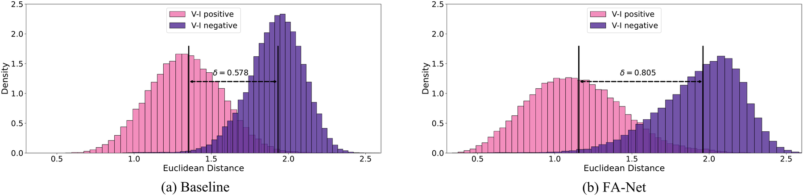
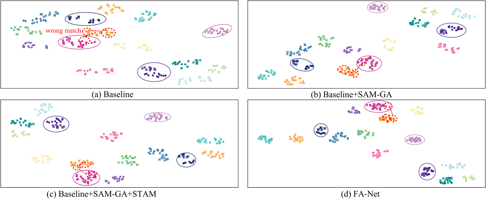
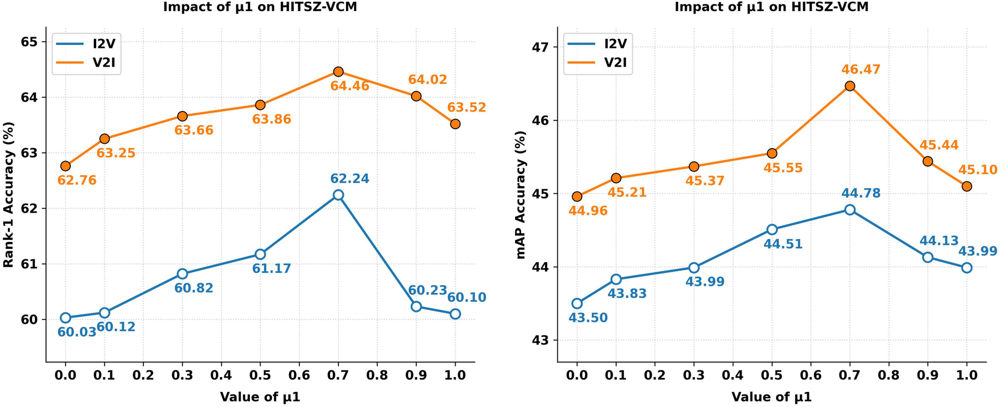

# FA-Net: A Feature Alignment Network for Video-Based Visible-Infrared Person Re-Identification

**Xi Yang**, Wenjiao Dong, Xian Wang, De Cheng\*, Nannan Wang

*IEEE Transactions on Image Processing (TIP)*, vol. 34, pp. 8406–8420, 2025

- **Paper (DOI):** <https://doi.org/10.1109/TIP.2025.3642633>
- **IEEE Xplore:** <https://ieeexplore.ieee.org/document/11301926>
- **Code:** <https://github.com/yangxlab/FANet>

Xi Yang, Wenjiao Dong, De Cheng and Nannan Wang are with the State Key Laboratory of Integrated Services Networks, School of Telecommunications Engineering, Xidian University, Xi'an 710071, China. Xian Wang is with the Hangzhou Institute of Technology, Xidian University, Hangzhou 311231, China. (\*Corresponding author: De Cheng.)

---

## Overview

Video-based visible-infrared person re-identification (VVI-ReID) aims to match target pedestrians between visible and infrared videos, which is of great significance for 24-hour surveillance systems. The key challenge is to learn **modality-invariant** and **spatio-temporal-invariant** sequence-level representations, in the presence of modality differences, spatio-temporal misalignment and domain shift noise.

<p align="center">
  
</p>

<p align="center"><sub><i>Fig. 1 — Illustration of the current challenges of video-based visible-infrared person re-identification: modality difference (green), spatio-temporal misalignment (purple) and domain shift noise (orange).</i></sub></p>

Existing methods predominantly emphasize reducing modality discrepancy while relatively neglecting temporal misalignment and domain shift noise reduction. To this end, this paper proposes a VVI-ReID framework called **Feature Alignment Network (FA-Net)** from the perspective of feature alignment, forming a complete hierarchical alignment system that acts at the **input**, **feature** and **distribution** levels.

## Abstract

Video-based visible-infrared person re-identification (VVI-ReID) aims to match target pedestrians between visible and infrared videos, which is significantly applied in 24-hour surveillance systems. The key of VVI-ReID is to learn modality invariant and spatio-temporal invariant sequence-level representation to solve the challenges such as modality differences, spatio-temporal misalignment, and domain shift noise. However, existing methods predominantly emphasize on reducing modality discrepancy while relatively neglect temporal misalignment and domain shift noise reduction. To this end, this paper proposes a VVI-ReID framework called Feature Alignment Network (FA-Net) from the perspective of feature alignment, aiming to mitigate temporal misalignment.

FA-Net comprises two main alignment modules: Spatial-Temporal Alignment Module (STAM) and Modality Distribution Constraint (MDC). STAM integrates global and local features to ensure individuals' spatial representation alignment. Additionally, STAM also establishes temporal relationships by exploring inter-frame features to address cross-frame person feature matching. Furthermore, we introduce the Modality Distribution Constraint (MDC), which utilizes a symmetric distribution loss to align the distributions of features from different modalities. Besides, the SAM Guidance Augmentation (SAM-GA) strategy is designed to transform the image space of RGB and IR frames to provide more informative and less noisy frame information. Extensive experimental results demonstrate the effectiveness of the proposed method, surpassing existing *state-of-the-art* methods.

## Highlights

- **Spatio-Temporal Alignment Module (STAM)** — a three-branch structured design (spatial alignment, temporal alignment, spatial-and-temporal alignment) that aligns spatial representations from both global and local feature perspectives, establishes temporal relationships by exploiting inter-frame features, and dynamically adapts multi-scale features through a gating-based fusion mechanism.
- **Modality Distribution Constraint (MDC)** — a symmetric distribution loss built on Optimal Transport (OT) theory. Instead of measuring the difference between two single samples (as Euclidean / Mahalanobis distance does), it minimizes the cost of transforming one feature distribution into another, thereby constraining the visible-infrared representation at the distribution level.
- **SAM-Guided Augmentation (SAM-GA)** — leverages the strong representation and generalization capability of the Segment Anything Model to transform the image space of RGB and IR frames. Rather than following the paradigm of hard segmentation replacement, it performs training-only stochastic convex mixing between raw and mask-filtered video frames, with asymmetric randomization across the visible and infrared streams, suppressing domain-shift noise while retaining controllably attenuated contextual cues.

## Method

### Overall Architecture

<p align="center">
  
</p>

<p align="center"><sub><i>Fig. 2 — Architecture of FA-Net. Given a sequence, the SAM-GA module is first applied to remove domain shift noise and enhance each frame representation. Apart from the CNN backbone, FA-Net mainly consists of STAM and MDC. STAM aligns the spatial representation using global and local features and employs inter-frame feature mining to explore temporal clues; MDC applies a symmetric distribution loss to constrain the feature distributions of the two modalities.</i></sub></p>

### SAM Guidance Augmentation (SAM-GA)

<p align="center">
  
</p>

<p align="center"><sub><i>Fig. 3 — Architecture of the SAM Guidance Augmentation (SAM-GA). The image branch is on the left and the video branch on the right.</i></sub></p>

### Spatio-Temporal Alignment Module (STAM)

<p align="center">
  
</p>

<p align="center"><sub><i>Fig. 4 — Architecture of the Spatio-Temporal Alignment Module (STAM). In practical implementation, STAM comprises three branches: the Spatial Feature Alignment branch, the Temporal Feature Alignment branch, and the Spatio-Temporal Feature Alignment branch.</i></sub></p>

### Alignment Quality

<p align="center">
  
</p>

<p align="center"><sub><i>Fig. 5 — Comparison of feature responses with and without STAM. (a) Input visible image and its feature heatmaps. (b) Input infrared image and its feature heatmaps. The second column shows feature responses without STAM, while the third column displays responses after incorporating STAM.</i></sub></p>

Without STAM the model exhibits significant responses to background and occlusions (dispersed red highlighted areas); with STAM, the model's attention distinctly focuses on the main structure of pedestrians, showing more precise feature localization in both visible and infrared modalities.

## Experimental Results

### Dataset: HITSZ-VCM

All experiments are mainly conducted on the **HITSZ-VCM** dataset, the first benchmark for video-based visible-infrared person re-identification.

| Item | HITSZ-VCM |
| --- | --- |
| Identities | 927 |
| Resolution | 288 × 144 |
| Tracklets | 21,863 |
| Visible cameras | 12 |
| Infrared cameras | 12 |
| Bounding box | detected |
| Evaluation | CMC & mAP |

The dataset contains 11,785 visible and 10,078 infrared pedestrian trajectories (251,452 visible images and 211,807 infrared images in total). Each trajectory consists of a sequence of 24 consecutive frames.

### Comparison with State-of-the-Art Methods

| Method | Extra data | I2V R1 | I2V R5 | I2V R10 | I2V R20 | I2V mAP | V2I R1 | V2I R5 | V2I R10 | V2I R20 | V2I mAP |
| --- | --- | --- | --- | --- | --- | --- | --- | --- | --- | --- | --- |
| LbA | image | 46.38 | 65.29 | 72.23 | 79.41 | 30.69 | 49.30 | 69.27 | 75.90 | 82.21 | 32.38 |
| MPANet | image | 46.51 | 63.07 | 70.51 | 77.77 | 35.26 | 50.32 | 67.31 | 73.56 | 79.66 | 37.80 |
| DDAG | image | 54.62 | 69.79 | 76.05 | 81.50 | 39.26 | 59.03 | 74.64 | 79.53 | 84.04 | 41.50 |
| VCD | image | 54.53 | 70.01 | 76.28 | 82.01 | 41.18 | 57.52 | 73.66 | 79.38 | 83.61 | 43.45 |
| CAJL | image | 56.59 | 73.49 | 79.52 | 84.05 | 41.49 | 60.13 | 74.62 | 79.86 | 84.53 | 42.81 |
| MITML | video | 63.74 | 76.88 | 81.72 | 86.28 | 45.31 | 64.54 | 78.96 | 82.98 | 87.10 | 17.69 |
| SOT | video | 64.97 | 78.12 | 82.81 | 86.87 | 47.74 | 67.93 | 81.07 | 84.94 | 88.59 | 49.67 |
| IBAN | video | 65.03 | 78.34 | 82.98 | 87.19 | 48.77 | 69.58 | 81.51 | 85.43 | 88.78 | 50.96 |
| DMA | video | 66.64 | 83.18 | 87.78 | – | 50.17 | 69.90 | 84.19 | 87.92 | – | 52.31 |
| AuxNet | video | 51.10 | – | – | – | 46.00 | 54.60 | – | – | – | 48.70 |
| ASAM | video | 65.31 | 77.86 | 82.66 | 87.35 | 49.49 | 67.66 | 80.74 | 85.13 | 89.14 | 51.76 |
| **FA-Net (Ours)** | video | **68.13** | **79.65** | **84.01** | **88.13** | **51.15** | **70.01** | **82.11** | **85.98** | **89.19** | **52.46** |

In the infrared-to-visible mode, FA-Net achieves about **3.0%** improvement in both Rank-1 accuracy and mAP over IBAN, and about **3.2% / 3.4%** over SOT; it also clearly outperforms all image-based cross-modality methods.

### Ablation Study

Effect of the key modules (I2V and V2I):

| Baseline | STAM | MDC | SAM-GA | I2V R1 | I2V R5 | I2V R10 | I2V R20 | I2V mAP | V2I R1 | V2I R5 | V2I R10 | V2I R20 | V2I mAP |
| --- | --- | --- | --- | --- | --- | --- | --- | --- | --- | --- | --- | --- | --- |
| ✓ | – | – | – | 59.77 | 74.11 | 79.34 | 84.21 | 43.21 | 62.58 | 77.66 | 82.06 | 85.98 | 44.93 |
| ✓ | ✓ | – | – | 62.63 | 76.77 | 82.09 | 86.32 | 45.64 | 66.21 | 79.74 | 83.66 | 87.43 | 47.25 |
| ✓ | – | ✓ | – | 62.24 | 76.61 | 81.74 | 86.13 | 44.78 | 64.46 | 78.33 | 82.82 | 86.72 | 46.40 |
| ✓ | – | – | ✓ | 61.26 | 75.89 | 81.33 | 85.91 | 43.86 | 64.93 | 79.82 | 84.70 | 88.49 | 45.51 |
| ✓ | ✓ | ✓ | – | 65.31 | 78.34 | 83.07 | 87.67 | 48.57 | 67.27 | 80.56 | 84.76 | 88.29 | 50.31 |
| ✓ | – | ✓ | ✓ | 64.16 | 77.05 | 82.24 | 86.54 | 46.57 | 67.70 | 80.33 | 84.55 | 87.70 | 48.32 |
| ✓ | ✓ | – | ✓ | 65.73 | 79.32 | 83.73 | 87.33 | 50.07 | 68.72 | 82.02 | 86.19 | 89.59 | 51.30 |
| **FA-Net** | ✓ | ✓ | ✓ | **68.13** | **79.65** | **84.01** | **88.13** | **51.15** | **70.01** | **82.11** | **85.98** | **89.19** | **52.46** |

FA-Net achieves a performance improvement of nearly **8.0%** over the baseline in both Rank-1 and mAP.

Comparison of different distribution losses:

| Method | I2V R1 | I2V R5 | I2V R10 | I2V R20 | I2V mAP | V2I R1 | V2I R5 | V2I R10 | V2I R20 | V2I mAP |
| --- | --- | --- | --- | --- | --- | --- | --- | --- | --- | --- |
| Baseline | 59.77 | 74.11 | 79.34 | 84.21 | 43.21 | 62.58 | 77.66 | 82.06 | 85.98 | 44.93 |
| MMD | 61.23 | 75.34 | 80.45 | 85.32 | 44.09 | 64.78 | 78.22 | 82.61 | 86.37 | 46.12 |
| KL | 60.45 | 74.76 | 79.89 | 84.67 | 43.76 | 64.21 | 78.09 | 82.45 | 86.09 | 45.32 |
| JSD | 60.12 | 74.43 | 79.67 | 84.45 | 43.54 | 63.89 | 77.98 | 82.32 | 85.76 | 45.11 |
| **MDC (ours)** | **62.24** | **76.61** | **81.74** | **86.13** | **44.78** | **64.46** | **78.33** | **82.82** | **86.72** | **46.40** |

### Generalization to Image-Based ReID

Adding SAM-GA and MDC on top of DDAG and AGW, evaluated on SYSU-MM01 and RegDB:

| Method | All-Search R1 | All-Search mAP | Indoor R1 | Indoor mAP | V2I R1 | V2I mAP | I2V R1 | I2V mAP |
| --- | --- | --- | --- | --- | --- | --- | --- | --- |
| DDAG | 54.75 | 53.02 | 61.02 | 67.98 | 69.34 | 63.46 | 68.06 | 61.80 |
| DDAG + SAM-GA | 55.21 | 53.45 | 61.48 | 68.42 | 69.87 | 63.92 | 68.51 | 62.25 |
| DDAG + MDC | **55.38** | **53.59** | **61.67** | **68.61** | **70.05** | **64.18** | **68.79** | **62.48** |
| AGW | 47.50 | 47.65 | 54.17 | 62.97 | 70.05 | 66.37 | 70.49 | 65.90 |
| AGW + SAM-GA | 47.92 | 47.98 | 54.56 | 63.35 | 70.48 | 66.82 | 70.92 | 66.32 |
| AGW + MDC | **48.15** | **48.21** | **54.83** | **63.62** | **70.76** | **67.05** | **71.24** | **66.58** |

This demonstrates that the proposed modules are not only applicable to video data, but also effectively handle cross-modal matching in static images.

### Complexity Analysis

| Method | Inference Params | Inference FLOPs | Training Params | Training FLOPs |
| --- | --- | --- | --- | --- |
| Baseline | 82.43M | 57.0G | – | – |
| **FA-Net (Ours)** | 88.57M | 60.6G | – | – |
| SAM-GA | – | – | 632M | 0 |
| STAM | – | – | 6.14M | 3.4G |
| MDC | – | – | 0 | 0.2G |

The SAM-GA module operates only during training with frozen parameters and is removed during inference. FA-Net requires 88.57M parameters (+7.4% over baseline) and 60.6G FLOPs (+6.3%) at inference time, with only 4.1% latency overhead — an optimal efficiency–effectiveness trade-off.

## Visualization

### Distance Distribution of Cross-Modality Pairs

<p align="center">
  
</p>

<p align="center"><sub><i>Fig. 6 — Visualization of the distance distribution of randomly selected cross-modality positive and negative pairs. The gap between the mean distances of positive and negative pairs is significantly larger in FA-Net.</i></sub></p>

### Feature Distribution (t-SNE)

<p align="center">
  
</p>

<p align="center"><sub><i>Fig. 7 — Feature distribution visualization. Different colors denote different IDs, the "cross" symbol denotes infrared features, the "dot" symbol denotes visible features, and the red circles denote mis-matched samples correctly corrected under our method.</i></sub></p>

### Parameter Sensitivity

<p align="center">
  
</p>

<p align="center"><sub><i>Fig. 8 — Parameter sensitivity analysis on the MDC weights μ<sub>1</sub> and μ<sub>2</sub>.</i></sub></p>

## Code

### Repository Structure

| File | Description |
| --- | --- |
| `train.py` | Training entry point (includes SAM-GA, STAM and MDC) |
| `test.py` | Testing / evaluation entry point |
| `model_main.py` | Backbone, STAM and the overall network definition |
| `loss.py` | Loss functions (`OriTripletLoss`, `CenterTripletLoss`, `MMD_loss`, `KLDivLoss`, `JSDLoss`, `SOTLoss`, ...) |
| `data_manager.py` | Dataset definition and sampling for HITSZ-VCM |
| `data_loader.py` | Video dataset loaders for training / testing |
| `eval_metrics.py` | CMC and mAP evaluation |
| `ChannelAug.py` | Channel augmentation and random erasing |
| `resnet.py`, `inflate.py` | ResNet backbone and I3D-style inflation |
| `transforms.py`, `utils.py`, `rank.py` | Helper utilities |
| `tsne.py`, `tsne1.py` | Feature distribution (t-SNE) visualization |

### Environment

The code is implemented with PyTorch. Main dependencies:

```
python >= 3.7
torch, torchvision
numpy, scipy
tensorboardX
Pillow
mobile_sam  (MobileSAM, for the SAM-GA module)
```

### Data Preparation

Please download the **HITSZ-VCM** dataset and set its root path in `data_manager.py`:

```python
class VCM(object):
    root = '/path/to/VCM-HITSZ/'
```

### Training

```bash
python train.py --dataset VCM --arch resnet50 --gpu 0
```

### Testing

```bash
python test.py --dataset VCM --mode all --gpu 0 -r save_model/<your_checkpoint>.t
```

The result of both retrieval modes (infrared to visible and visible to infrared) is printed as Rank-1 / Rank-5 / Rank-10 / Rank-20 / mAP.

## Acknowledgements

This work was supported in part by the National Natural Science Foundation of China under Grants 62372348, 62576262, U22A2096 and 62036007, in part by the Key Research and Development Program of Shaanxi under Grant 2024GX-ZDCYL-02-10, in part by the Shaanxi Outstanding Youth Science Fund Project under Grant 2023-JC-JQ-53, in part by Scientific and Technological Innovation Teams in Shaanxi Province under Grant 2025RS-CXTD-011, in part by the Shaanxi Province Core Technology Research and Development Project under Grant 2024QY2-GJHX-11, and in part by the Fundamental Research Funds for the Central Universities under Grants QTZX25083 and QTZX23042.

The SAM-GA strategy builds upon [MobileSAM](https://github.com/ChaoningZhang/MobileSAM).

## Citation

If you find this work useful for your research, please consider citing:

```bibtex
@article{yang2025fanet,
  author    = {Xi Yang and Wenjiao Dong and Xian Wang and De Cheng and Nannan Wang},
  title     = {FA-Net: A Feature Alignment Network for Video-Based Visible-Infrared Person Re-Identification},
  journal   = {IEEE Transactions on Image Processing},
  volume    = {34},
  pages     = {8406--8420},
  year      = {2025},
  doi       = {10.1109/TIP.2025.3642633}
}
```
