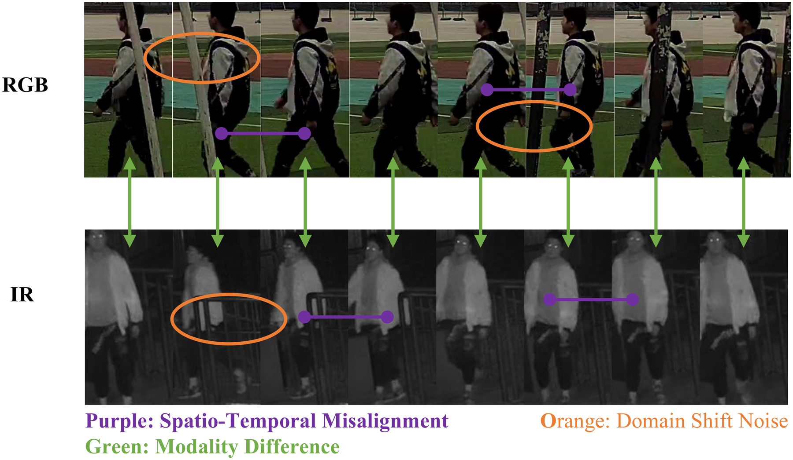
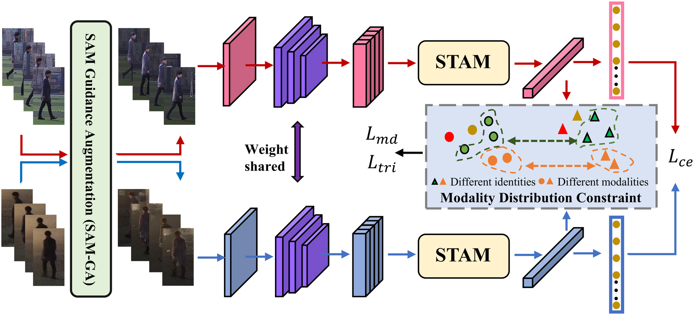
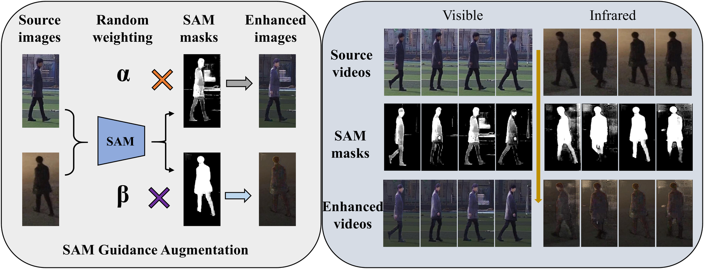
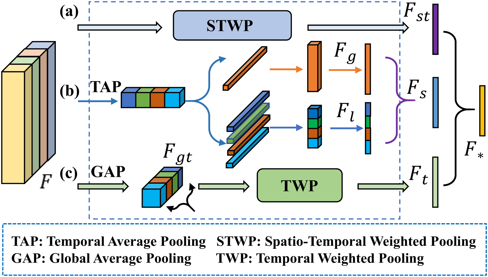
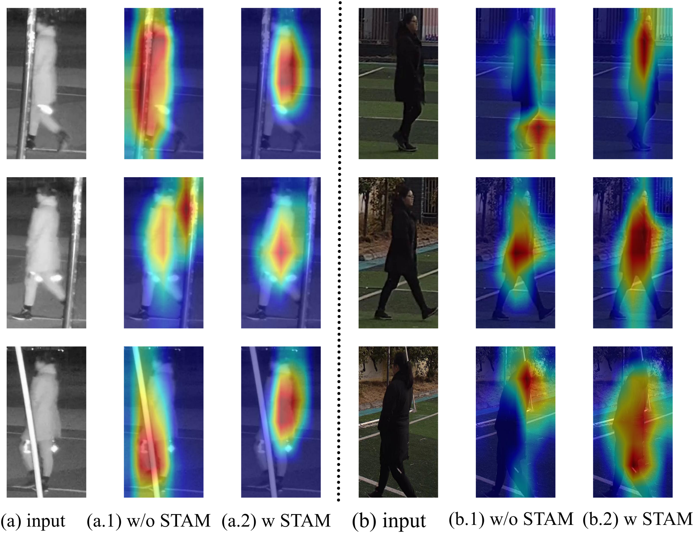

# FA-Net: A Feature Alignment Network for Video-Based Visible-Infrared Person Re-Identification

**Xi Yang**, Wenjiao Dong, Xian Wang, De Cheng\*, Nannan Wang

*IEEE Transactions on Image Processing (TIP)*, vol. 34, pp. 8406–8420, 2025

- **Paper (DOI):** <https://doi.org/10.1109/TIP.2025.3642633>
- **IEEE Xplore:** <https://ieeexplore.ieee.org/document/11301926>
- **Code:** <https://github.com/yangxlab/FANet>

Xi Yang, Wenjiao Dong, De Cheng and Nannan Wang are with the State Key Laboratory of Integrated Services Networks, School of Telecommunications Engineering, Xidian University, Xi'an 710071, China. Xian Wang is with the Hangzhou Institute of Technology, Xidian University, Hangzhou 311231, China. (\*Corresponding author: De Cheng.)

---

## Overview

Video-based visible-infrared person re-identification (VVI-ReID) aims to match target pedestrians between visible and infrared videos, which is of great significance for 24-hour surveillance systems. The key challenge is to learn **modality-invariant** and **spatio-temporal-invariant** sequence-level representations, in the presence of modality differences, spatio-temporal misalignment and domain shift noise.

<p align="center">
  
</p>

<p align="center"><sub><i>Fig. 1 — Illustration of the current challenges of video-based visible-infrared person re-identification: modality difference (green), spatio-temporal misalignment (purple) and domain shift noise (orange).</i></sub></p>

Existing methods predominantly emphasize reducing modality discrepancy while relatively neglecting temporal misalignment and domain shift noise reduction. To this end, this paper proposes a VVI-ReID framework called **Feature Alignment Network (FA-Net)** from the perspective of feature alignment, forming a complete hierarchical alignment system that acts at the **input**, **feature** and **distribution** levels.

## Method

### Overall Architecture

<p align="center">
  
</p>

<p align="center"><sub><i>Fig. 2 — Architecture of FA-Net. Given a sequence, the SAM-GA module is first applied to remove domain shift noise and enhance each frame representation. Apart from the CNN backbone, FA-Net mainly consists of STAM and MDC. STAM aligns the spatial representation using global and local features and employs inter-frame feature mining to explore temporal clues; MDC applies a symmetric distribution loss to constrain the feature distributions of the two modalities.</i></sub></p>

FA-Net comprises three components:

- **SAM-Guided Augmentation (SAM-GA)** — leverages the Segment Anything Model to transform the image space of RGB and IR frames, performing training-only stochastic convex mixing between raw and mask-filtered frames to suppress domain-shift noise.
- **Spatio-Temporal Alignment Module (STAM)** — a three-branch design (spatial / temporal / spatio-temporal alignment) that aligns spatial representations from global and local perspectives and establishes temporal relationships across frames.
- **Modality Distribution Constraint (MDC)** — a symmetric distribution loss built on Optimal Transport theory, which minimizes the cost of transforming one modality's feature distribution into the other.

### SAM Guidance Augmentation (SAM-GA)

<p align="center">
  
</p>

<p align="center"><sub><i>Fig. 3 — Architecture of the SAM Guidance Augmentation (SAM-GA). The image branch is on the left and the video branch on the right.</i></sub></p>

### Spatio-Temporal Alignment Module (STAM)

<p align="center">
  
</p>

<p align="center"><sub><i>Fig. 4 — Architecture of the Spatio-Temporal Alignment Module (STAM). In practical implementation, STAM comprises three branches: the Spatial Feature Alignment branch, the Temporal Feature Alignment branch, and the Spatio-Temporal Feature Alignment branch.</i></sub></p>

### Alignment Quality

<p align="center">
  
</p>

<p align="center"><sub><i>Fig. 5 — Comparison of feature responses with and without STAM. (a) Input visible image and its feature heatmaps. (b) Input infrared image and its feature heatmaps. The second column shows feature responses without STAM, while the third column displays responses after incorporating STAM.</i></sub></p>

Without STAM the model exhibits significant responses to background and occlusions (dispersed red highlighted areas); with STAM, the model's attention distinctly focuses on the main structure of pedestrians, showing more precise feature localization in both visible and infrared modalities.

## Code

### Repository Structure

| File | Description |
| --- | --- |
| `train.py` | Training entry point (includes SAM-GA, STAM and MDC) |
| `test.py` | Testing / evaluation entry point |
| `model_main.py` | Backbone, STAM and the overall network definition |
| `loss.py` | Loss functions (`OriTripletLoss`, `CenterTripletLoss`, `MMD_loss`, `KLDivLoss`, `JSDLoss`, `SOTLoss`, ...) |
| `data_manager.py` | Dataset definition and sampling for HITSZ-VCM |
| `data_loader.py` | Video dataset loaders for training / testing |
| `eval_metrics.py` | CMC and mAP evaluation |
| `ChannelAug.py` | Channel augmentation and random erasing |
| `resnet.py`, `inflate.py` | ResNet backbone and I3D-style inflation |
| `transforms.py`, `utils.py`, `rank.py` | Helper utilities |
| `tsne.py`, `tsne1.py` | Feature distribution (t-SNE) visualization |

### Environment

The code is implemented with PyTorch. Main dependencies:

```
python >= 3.7
torch, torchvision
numpy, scipy
tensorboardX
Pillow
mobile_sam  (MobileSAM, for the SAM-GA module)
```

### Data Preparation

Please download the **HITSZ-VCM** dataset and set its root path in `data_manager.py`:

```python
class VCM(object):
    root = '/path/to/VCM-HITSZ/'
```

### Training

```bash
python train.py --dataset VCM --arch resnet50 --gpu 0
```

### Testing

```bash
python test.py --dataset VCM --mode all --gpu 0 -r save_model/<your_checkpoint>.t
```

The result of both retrieval modes (infrared to visible and visible to infrared) is printed as Rank-1 / Rank-5 / Rank-10 / Rank-20 / mAP.

## Acknowledgements

The SAM-GA strategy builds upon [MobileSAM](https://github.com/ChaoningZhang/MobileSAM).

## Citation

If you find this work useful for your research, please consider citing:

```bibtex
@article{yang2025fanet,
  author    = {Xi Yang and Wenjiao Dong and Xian Wang and De Cheng and Nannan Wang},
  title     = {FA-Net: A Feature Alignment Network for Video-Based Visible-Infrared Person Re-Identification},
  journal   = {IEEE Transactions on Image Processing},
  volume    = {34},
  pages     = {8406--8420},
  year      = {2025},
  doi       = {10.1109/TIP.2025.3642633}
}
```
